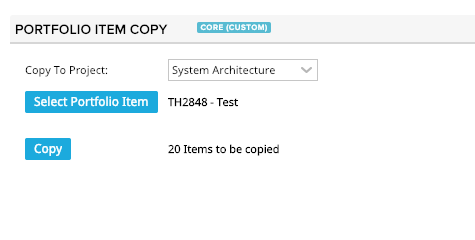
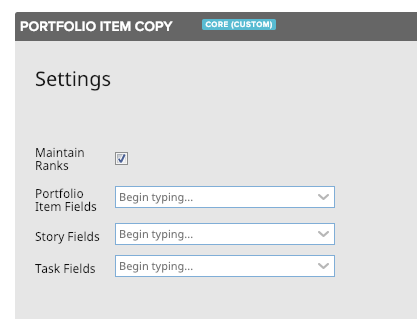

# Portfolio Item Copy

This app copies a portfolio item and its descendants, including other portfolio items, user stories (including user story hierarchies) and tasks. 

By default, it copies the following fields:
- Name
- Description
- Owner
- Parent
- Tags

If there are required fields, the app will attempt to copy those fields, as well.  If the Release field is required for stories, the app will present the user with a drop-down box for default release to put in as a placeholder for any parent stories that are being copied.  (A parent story cannot have a release, so if it's required, a parent being copied will fail to copy because the story is first created as a standalone and then becomes a parent when a child is assigned to it.)

## Settings

This app can be configured via the Edit App Settings gear menu item.

#### Maintain Ranks  

This allows for the rank order to be maintained in the copy.  For large trees, this could be slower.  (default: true)

#### Feature Fields

Use to set additional fields from PortfolioItems to copy beyond the default and required fields.

#### Story Fields

Use to set additional fields from User Stories to copy beyond the default and required fields.

#### Task Fields

Use to set additional fields from Tasks to copy beyond the default and required fields.

