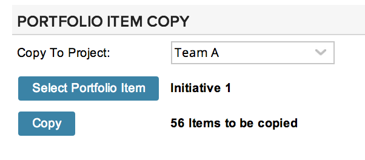
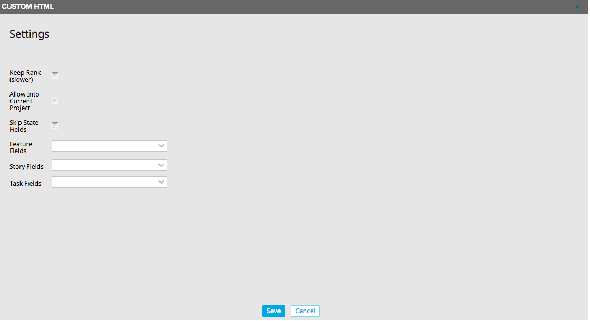

portfolio-item-copy
=========================

## Overview

This app copies a portfolio item and its descendants, including other portfolio items, user stories (including user story hierarchies) and tasks. 

By default, it copies the following fields:
- Name
- Description
- Owner
- Parent
- Tags

If there are required fields, the app will attempt to copy those fields, as well.  If the Release field is required for stories, the app will present the user with a drop-down box for default release to put in as a placeholder for any parent stories that are being copied.  (A parent story cannot have a release, so if it's required, a parent being copied will fail to copy because the story is first created as a standalone and then becomes a parent when a child is assigned to it.)

This app can be configured:

* Keep Rank (slower):  This allows for the rank order to be maintained in the copy.  For large trees, this could be slower.  (default: true)
* Allow Into Current Project:  This allows the user to copy into the current project.  Set to false to prevent mistaken copies. (default: false)
* Skip State Fields:  This allows the copy to put Stories and Defects into their default states; otherwise, the app will attempt to set these.  Note that if the admin chooses Schedule State in the Story Fields setting or State in the Task Fields setting, then the app will copy the field values.  Note also that Feature State is not affected by this setting.  (default: false)

* Feature Fields: Use to set additional fields from PortfolioItems to copy beyond the required fields (and tags).
* Story Fields:  Use to set additional fields from User Stories to copy beyond the required fields (and tags).
* Task Fields:  Use to set additional fields from Tasks to copy beyond the required fields (and tags).

## License

AppTemplate is released under the MIT license.  See the file [LICENSE](./LICENSE) for the full text.

##Documentation for SDK

